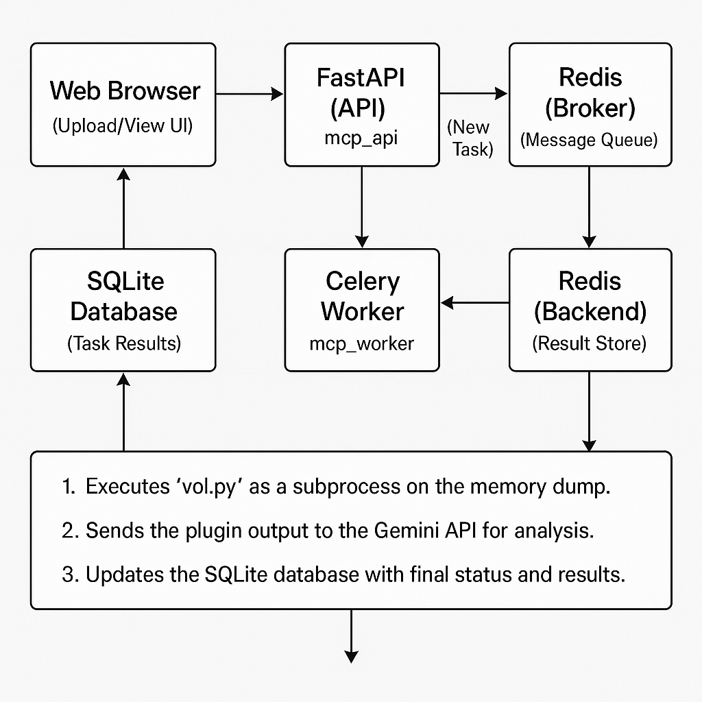

# Volatility Memory Analysis Web Service (MCP)

This project is a comprehensive web service for automating digital forensics memory analysis using Volatility 3. It provides a user-friendly web interface to upload memory dumps, run various Volatility plugins, and view the results, which are further analyzed by Google's Gemini AI for suspicious indicators.

The entire application is containerized with Docker and includes a full observability stack with Prometheus and Grafana for monitoring.

## Architecture

The application is built on a microservices-oriented architecture using FastAPI, Celery, Redis, and a full monitoring stack.



-   **FastAPI**: Serves the frontend UI and the main API endpoints.
-   **Celery**: Manages background tasks for long-running Volatility analysis.
-   **Redis**: Acts as both a message broker and a result backend for Celery.
-   **SQLite**: A simple file-based database to store task information and analysis results.
-   **Prometheus**: Scrapes metrics from the FastAPI app and Celery tasks.
-   **Grafana**: Provides dashboards for visualizing the metrics collected by Prometheus.

## Features

-   **Web UI for Uploads**: Simple drag-and-drop interface to upload memory images.
-   **Batch Plugin Execution**: Run multiple Volatility plugins against a single image from one request.
-   **Automated AI Analysis**: Volatility output is automatically sent to the Gemini API for a high-level analysis of suspicious indicators.
-   **Real-time Results Page**: A non-interactive report page that auto-refreshes to show the status of pending and completed tasks.
-   **Structured JSON Output**: Gemini analysis is returned in a clean JSON format, which is then parsed and displayed in tables and lists.
-   **Full Observability**: Comes with pre-configured Prometheus and Grafana containers for immediate monitoring.

## Setup and Installation

### Prerequisites

-   Docker
-   Docker Compose
-   A Google Gemini API Key

### Installation Steps

1.  **Clone the Repository**
    ```bash
    git clone https://github.com/bli8er/Gemini-Powered-Automated-Volatility-Analyzer.git
    cd Gemini-Powered-Automated-Volatility-Analyzer
    ```

2.  **Create an Environment File**
    Create a file named `.env` in the root directory of the project. This file will hold your secret API key. The `.gitignore` file is already configured to prevent this file from being committed.

    Add your Gemini API key to the `.env` file:
    ```
    GEMINI_API_KEY=YOUR_GEMINI_API_KEY_HERE
    ```

3.  **Place Volatility 3 in the Project**
    This project assumes you have a copy of the Volatility 3 source code in a folder named `volatility3` in the root of the project directory. The `docker-compose.yml` file is configured to mount this directory into the containers.

    Your directory structure should look like this:
    ```
    .
    ├── app/
    ├── volatility3/  <-- Place Volatility 3 source code here
    ├── docker-compose.yml
    ├── Dockerfile
    ├── .env
    └── README.md
    ```

4.  **Build and Run the Containers**
    Use Docker Compose to build the images and run all the services in the background.
    ```bash
    docker-compose up --build -d
    ```

## Usage

-   **Upload Page**: Open your browser and navigate to `http://localhost:8000/upload`
-   **Results Page**: Navigate to `http://localhost:8000/results` to see the status of your analysis tasks.
-   **Grafana Dashboard**: Access Grafana at `http://localhost:3001` (default login is `admin`/`admin`).
-   **Prometheus Targets**: Access Prometheus at `http://localhost:9091`.

## To Stop the Application

To stop all running services and remove the containers, run:
```bash
docker-compose down
